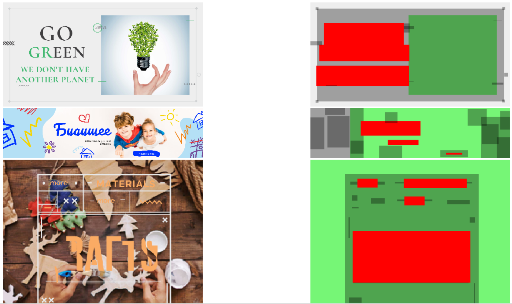
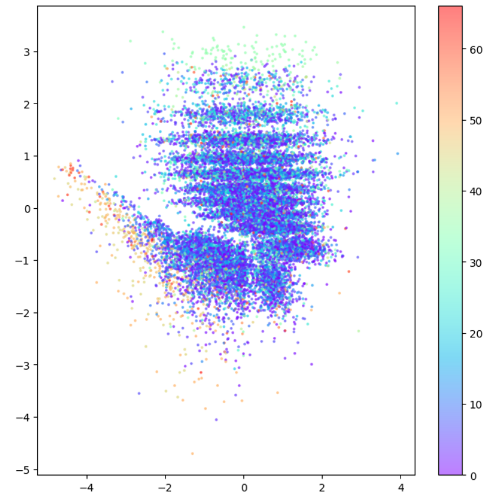
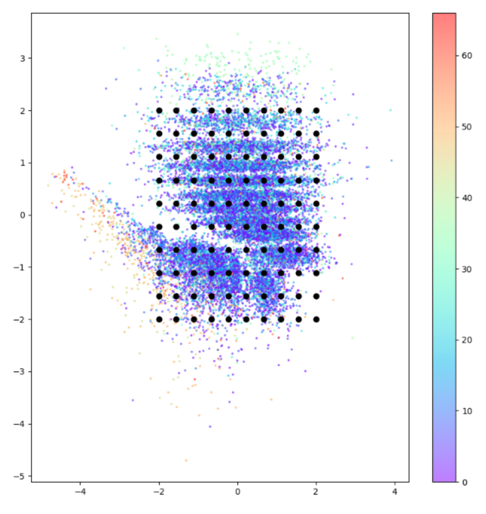
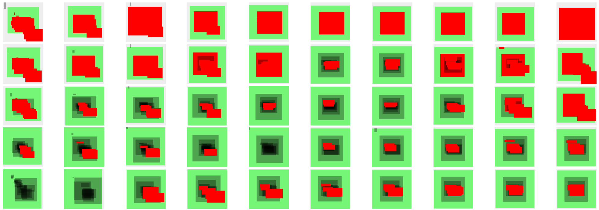
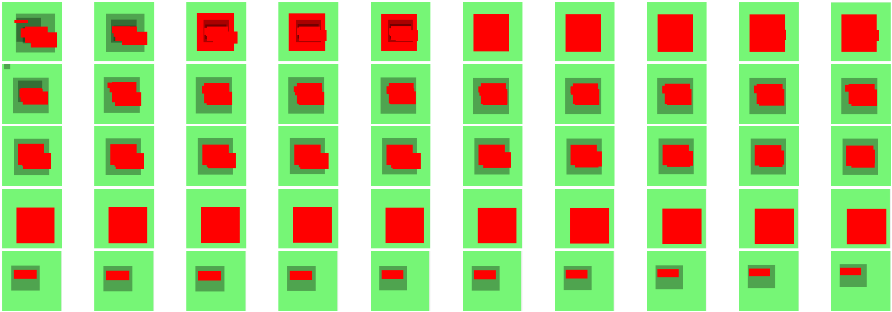

GenLayout
===
Generative AI to generate layouts

# LayoutVAE + Cyberagent/Crello datasets

Trains Variational Autoencoder ( VAE ) with training data produced by [CyberAgent/Crello](https://huggingface.co/datasets/cyberagent/crello)
and reconstructs layouts from sampling codes of latent space.

Click the above Badge to run the LayoutVAE in Google Colab.

## Preview of Crello datasets.

In preprocessing, layouts related to Image / Text / SVG Shape are extracted from the original datasets,
and training / validation / test datasets are constructed.

## Latent Vectors obtained by training VAE

After training VAE, we can obtain latent vectors of the training data by encoding
and a picture below is 2D graphic by rendering them.

Each color represents labels of `format` in the training data and we could observe some groups were
constructed because insntaces of same labels are located near during the training.

The label of orange represents instances whose formats are for documents such as resume, poster and so forth.
Light greens on above area represent instances whose formats are for zoom background by one picture.
And blue and purple instances represent marketing banners such as Instagram, Facebook, TikTok and so forth.

## Reconstruction with latent vectors

Each black point is grid data [-2, 2] by sampling latent space and
layouts can be generated by reconstructing with the decoder of VAE.

